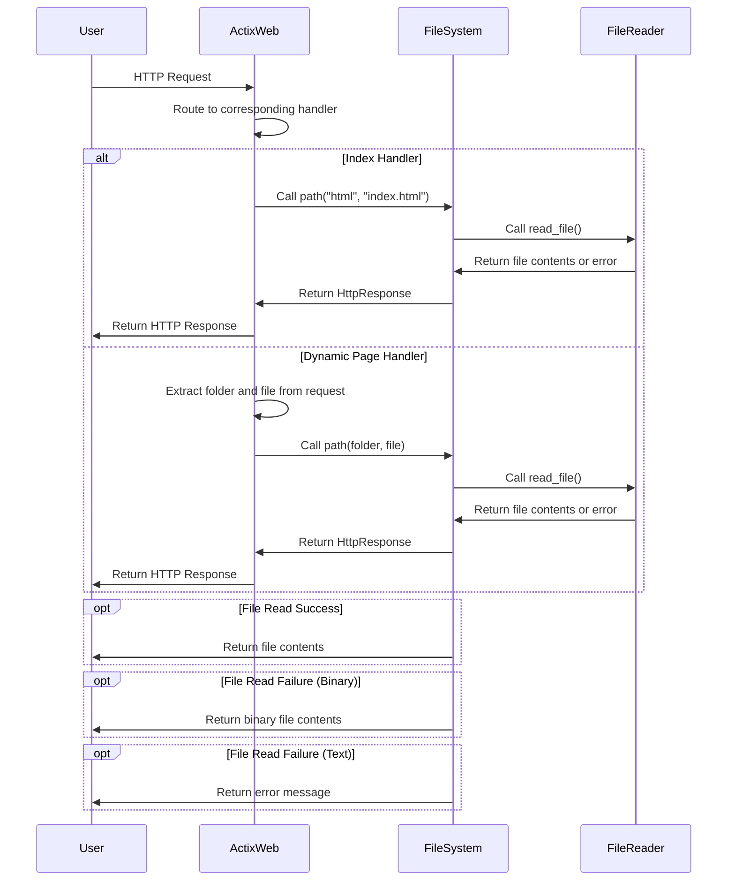

```mermaid
sequenceDiagram
    participant User
    participant ActixWeb
    participant FileSystem
    participant FileReader

    User->>ActixWeb: HTTP Request
    ActixWeb->>ActixWeb: Route to corresponding handler
    alt Index Handler
        ActixWeb->>FileSystem: Call path("html", "index.html")
        FileSystem->>FileReader: Call read_file()
        FileReader->>FileSystem: Return file contents or error
        FileSystem->>ActixWeb: Return HttpResponse
        ActixWeb->>User: Return HTTP Response
    else Dynamic Page Handler
        ActixWeb->>ActixWeb: Extract folder and file from request
        ActixWeb->>FileSystem: Call path(folder, file)
        FileSystem->>FileReader: Call read_file()
        FileReader->>FileSystem: Return file contents or error
        FileSystem->>ActixWeb: Return HttpResponse
        ActixWeb->>User: Return HTTP Response
    end
    opt File Read Success
        FileSystem->>User: Return file contents
    end
    opt File Read Failure (Binary)
        FileSystem->>User: Return binary file contents
    end
    opt File Read Failure (Text)
        FileSystem->>User: Return error message
    end
```